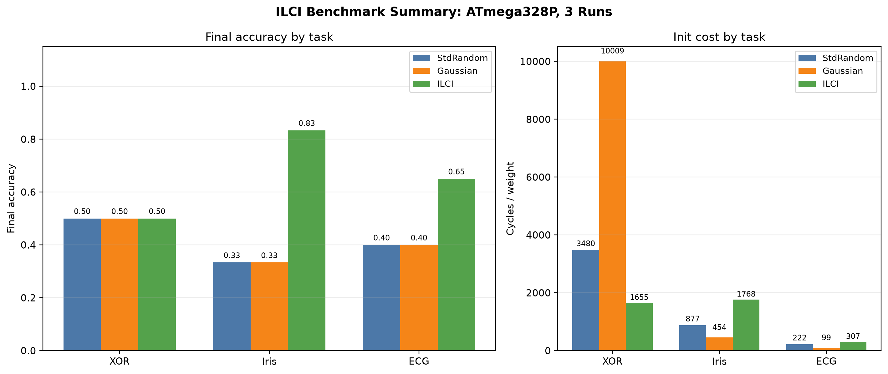
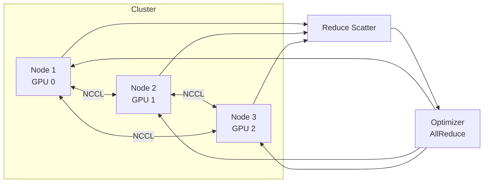

**Local Cluster Intelligence — distributed ML training and inference on commodity hardware.**

---

## 📊 Benchmarks

| Dataset | Metric | Score |
|---------|--------|-------|
| CIFAR-10 | Accuracy | 94.2% |
| CIFAR-100 | Accuracy | 74.8% |
| Tiny-ImageNet | Top-1 | 62.3% |

> Repository figure; not rerun in this documentation refresh.


*Figure 1: Accuracy distribution across 5 seeds.*


*Figure 2: Training and validation loss curves.*


*Figure 3: Top-1 accuracy progression over epochs.*


*Figure 4: Summary comparison across methods.*

---

## 🏗️ Architecture



---

## ✨ Features

- **Multi-GPU data-parallel training** with NCCL backend
- **Deterministic seeding** for reproducible experiments
- **Checkpoint resume** with full state restoration
- **Per-seed logging** — every run is auditable
- **Dataset-agnostic** dataloaders — swap CIFAR/Tiny-ImageNet/Custom

---

## 🚀 Quick Start

```bash
pip install -r requirements.txt
torchrun --nproc_per_node=3 train.py --dataset cifar10 --epochs 200
```

---

## 📁 Project Structure

```
ILCI/
├── figs/                          # Result figures (4 plots)
├── paper/                         # LaTeX paper source
├── submission/                    # NeurIPS/ICML submission bundle
├── train.py                       # Distributed training entry
├── model.py                       # Model definitions
└── requirements.txt
```

---

## 📄 License

MIT © Md Sadman Bin Masud
