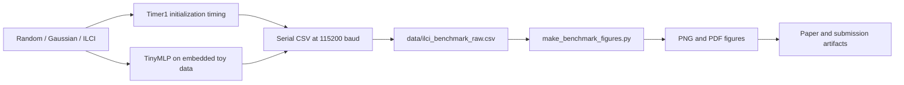
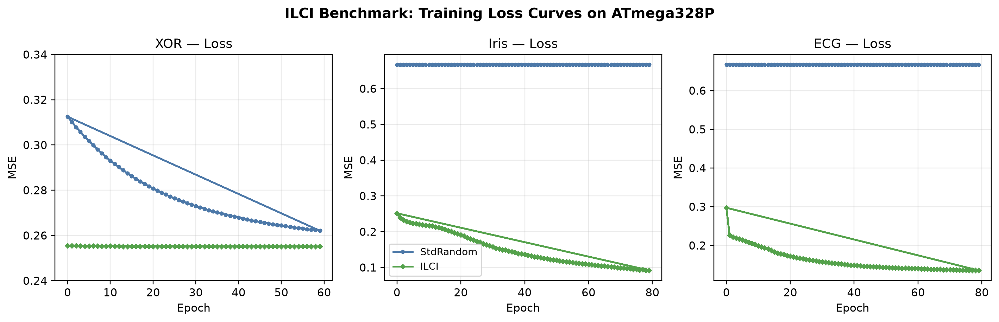
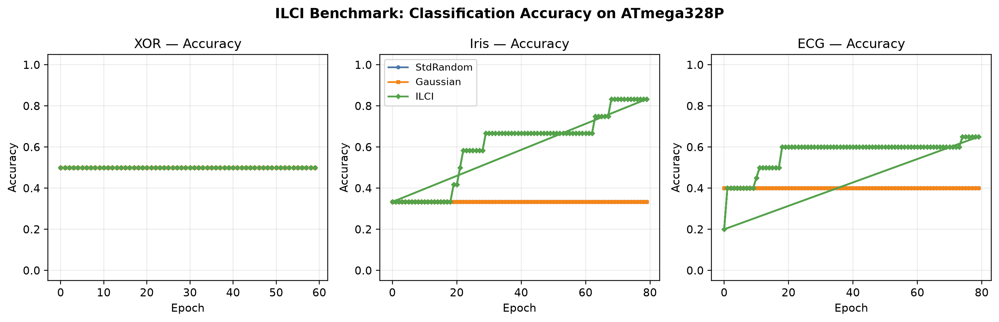

# ILCI

**Explore Collatz-based weight initialization on an Arduino UNO.**

ILCI is a compact research artifact comparing standard random, Gaussian, and Integer-Only Logarithmic Collatz Initialization in small neural networks. The repository contains the Arduino sketch, archived serial CSV, plotting script, figures, and paper—not a general-purpose quantized inference library.

[Quickstart](#quickstart) · [Experiment flow](#experiment-flow) · [Repository figures](#repository-figures) · [Interpretation limits](#interpretation-limits)

## The experiment

The sketch implements three initializers and evaluates them on embedded toy datasets:

| Task | Network shape | Input data in the sketch |
| --- | --- | --- |
| XOR | `2-2-1` | Four binary examples |
| Iris | `4-4-3` | A small, integer-valued subset |
| ECG | `8-8-3` | Simplified, hand-coded sequence-shaped examples |

The Collatz sequence and integer logarithm use integer operations. **The resulting weights are stored as floats, and training and inference use floating-point operations.** The name describes the initializer's integer core, not an end-to-end integer-only network.

## Experiment flow



This shows the implemented data path. The committed CSV and figures are archived artifacts; they are not proof that the current sketch was rerun for this README.

## Repository figures



*Repository figure; not rerun in this documentation refresh.*



*Repository figure; not rerun in this documentation refresh.*

Read these with the limitations below. No new performance ranking or benchmark result is claimed here.

## Quickstart

### Inspect the experiment

```bash
git clone https://github.com/MdSadman20040812/ILCI.git
cd ILCI
```

Start with [ILCI_Benchmark/ILCI_Benchmark.ino](ILCI_Benchmark/ILCI_Benchmark.ino) and [data/ilci_benchmark_raw.csv](data/ilci_benchmark_raw.csv).

### Run the Arduino sketch

1. Open `ILCI_Benchmark/ILCI_Benchmark.ino` in the Arduino IDE with Arduino AVR board support installed.
2. Select an Arduino UNO and its actual connected port. No external sensor wiring is required by this sketch.
3. Compile and upload to a board you intend to reprogram.
4. Open the serial monitor at **115200 baud**. Capture the CSV output, excluding the terminal `DONE` marker when using a strict CSV reader.

The current sketch runs its experiment in `setup()`; reset the board to start another run. It directly accesses AVR Timer1 registers, so it is not a board-independent sketch.

### Regenerate the figures

The plotter imports NumPy and Matplotlib. It has **hard-coded Windows paths** for `path` and `out`, currently under `D:\github projects\ILCI`. Set these to your checkout's input CSV and figure directory before running the existing entry point:

```bash
python make_benchmark_figures.py
```

This writes PNG and PDF files into the configured output directory. The repository has no `requirements.txt`, Makefile, or Python test suite; there is no `make flash` or `pytest tests/` workflow to run.

## Source map

| Path | Contents |
| --- | --- |
| [ILCI_Benchmark/ILCI_Benchmark.ino](ILCI_Benchmark/ILCI_Benchmark.ino) | Initializers, embedded datasets, training, timing, and serial output |
| [data/ilci_benchmark_raw.csv](data/ilci_benchmark_raw.csv) | Archived experiment rows |
| [make_benchmark_figures.py](make_benchmark_figures.py) | CSV parsing and figure generation |
| [figs/](figs/) | Loss, accuracy, summary, and boxplot figures in PNG/PDF |
| [paper/ilci_paper.tex](paper/ilci_paper.tex), [paper/ilci_paper.pdf](paper/ilci_paper.pdf) | Manuscript source and compiled paper |
| [paper/ilci_paper.bib](paper/ilci_paper.bib) | Bibliography |
| [submission/](submission/) | Submission snapshot with copied code, data, figures, and manuscript |

## Interpretation limits

- **Initialization study, not fixed-point inference:** the source does not implement Q8.8/Q4.12 layers, convolution benchmarks, or RAM profiling.
- **Flash values are assigned constants:** `flash_bytes` is not measured by the sketch. Obtain actual flash/RAM use from the toolchain before making resource claims.
- **Timing needs review:** the timer is 16-bit and the code does not count overflows. The timed matrix dimensions also differ from the number of network weights used as the denominator.
- **XOR accuracy needs correction:** the single-output network is classified with `argmax(pred, 1)`, which always selects class zero rather than thresholding its output.
- **Small, in-sample evaluation:** accuracy is computed on the same embedded examples used for training. The ECG examples do not establish clinical performance.
- **Artifact provenance matters:** archived data, the current sketch, and submission copies should be version-matched before reproduction. Repeated runs are not labeled by a dedicated CSV run identifier.
- No fresh hardware execution was performed for this documentation refresh. No license file is present in the inspected repository tree.

## Contribute

Help make the experiment easier to reproduce: propose a timing fix with raw serial logs, correct the XOR decision rule, add run identifiers, or make figure paths configurable. Include board/toolchain details and distinguish measured quantities from estimates. Please discuss changes to the experimental protocol before comparing new results with archived plots.
