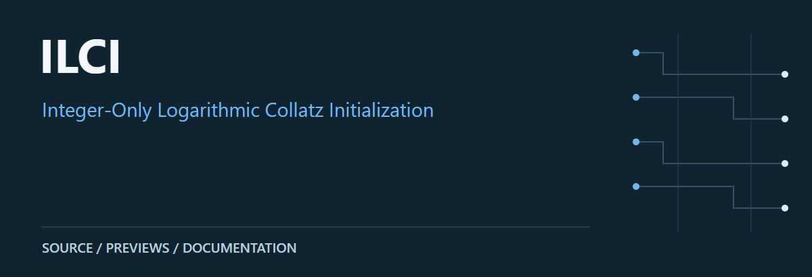
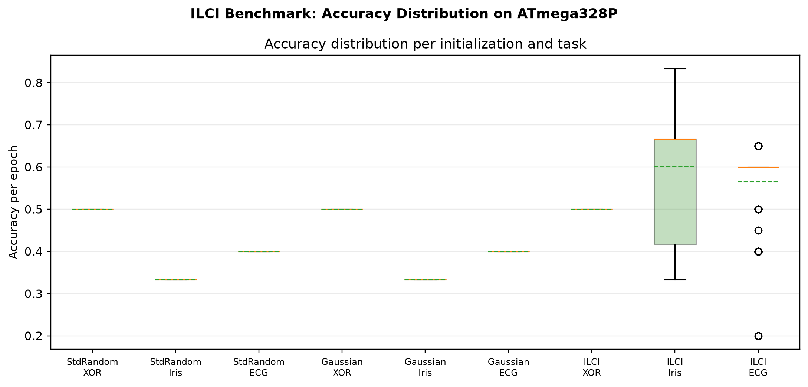
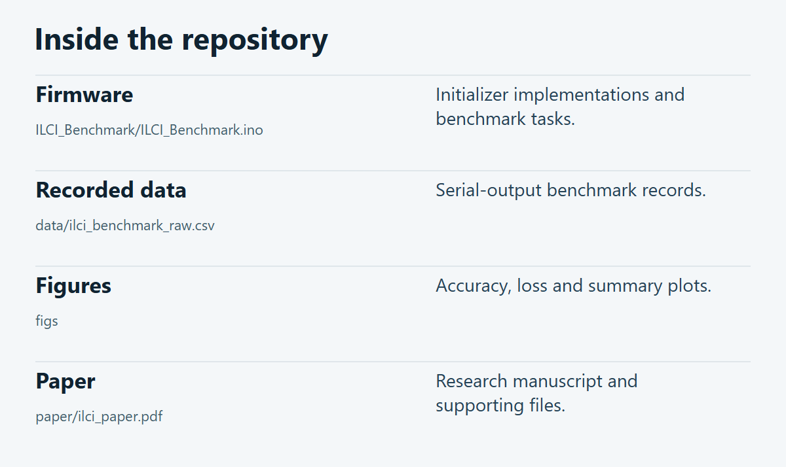

# ILCI

An Arduino Uno / ATmega328P benchmark comparing standard random, Gaussian and integer-based Collatz weight initialization. The repository includes firmware, recorded CSV output, figures and a paper.

**[Source guide](#source-guide)** · **[Getting started](#getting-started)** · **[Scope & limitations](#scope--limitations)**

## Preview

Existing repository accuracy plot. See the CSV and firmware for task definitions.

[Loss curves](figs/fig_loss_curves.png) · [Accuracy curves](figs/fig_accuracy_curves.png) · [Summary figure](figs/fig_summary_bars.png)

## Source guide

| Component | Open source | Purpose |
| :-- | :-- | :-- |
| Firmware | [`ILCI_Benchmark/ILCI_Benchmark.ino`](ILCI_Benchmark/ILCI_Benchmark.ino) | Initializer implementations and benchmark tasks. |
| Recorded data | [`data/ilci_benchmark_raw.csv`](data/ilci_benchmark_raw.csv) | Serial-output benchmark records. |
| Figures | [`figs`](figs) | Accuracy, loss and summary plots. |
| Paper | [`paper/ilci_paper.pdf`](paper/ilci_paper.pdf) | Research manuscript and supporting files. |

## Getting started

Use the linked source files and project documents above as the entry points. Review the prerequisites and limitations below before execution.

## Scope & limitations

The firmware names XOR, Iris-2 and simplified ECG-20 tasks. This is not a distributed-training framework. Existing research figures are reproduced as repository artifacts; the benchmarks were not rerun or independently validated in this presentation update.

---

[Visual asset sources and presentation notes](docs/visuals/README.md)
